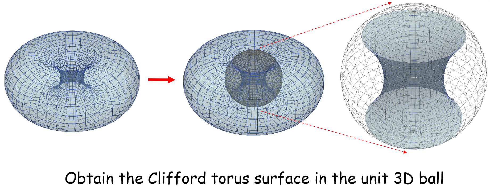

# Solve_PnL_by_Clifford_Torus

## This is the source code for a paper 

```
@article{LIU2025111659,
title = {Robustly solving PnL problem using Clifford tori},
journal = {Pattern Recognition},
volume = {166},
pages = {111659},
year = {2025},
issn = {0031-3203},
doi = {https://doi.org/10.1016/j.patcog.2025.111659},
url = {https://www.sciencedirect.com/science/article/pii/S003132032500319X},
author = {Yinlong Liu and Xueli Liu and Shengyong Ding and Zhi-Xin Yang},
keywords = {Robust pose estimation, Perspective-n-Line (PnL) problem, Rotation voting}
}
```

[https://doi.org/10.1016/j.patcog.2025.111659](https://doi.org/10.1016/j.patcog.2025.111659)


---
+ **show_torus_two.py** is to show the Clifford torus in $R^3$ using [pyvista](https://github.com/pyvista/pyvista) (VTK)
+ **Clifford_PnL.7z** is to test various PnL algorithms
  + **main_test_outliers.m** You can start it in Matlab 2023a to see the *Images* 
+ **Rot_Est_Liu.py** is to calculate the camera rotation of the PnL problem
+ **test_all.py** and **plot_all.py** is to check the power of the Clifford torus using python


Clifford Torus in $R^3$ by stereographic projection
--- 


<div align=center>
  


</div>

Images
---


Thanks
---
+ The Matlab test framework is copying from "Pose Estimation from Line Correspondences using Direct Linear Transformation" by **Dr. Bronislav Přibyl**, see https://www.fit.vutbr.cz/~ipribyl/DLT-based-PnL/

+ *The plot function aboxplot.m (Advanced Box Plot for Matlab)* by **Dr. Alex Bikfalvi** (alex@bikfalvi.com),see https://alex.bikfalvi.com/

---

Copyright @ YinlongLiu(AT)um.edu.mo
*March 2024*
