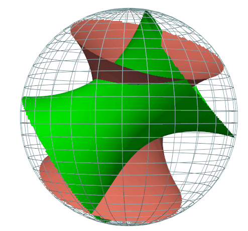
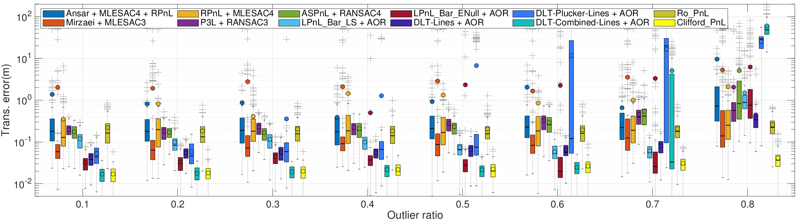
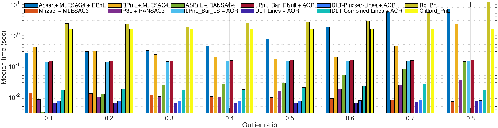

# Solve_PnL_by_Clifford_Torus
xxxxx

## 
This is source code for a paper 

+ **show_torus_two.py** is to show the Clifford torus in $R^3$
+ **Clifford_PnL.7z** is to test various PnL algorithms
  + **main_test_outliers.m** You can start it in matlab 2023a to see the *Images* 
+ **Rot_Est_Liu.py** is to calculate the camera rotation of the PnL problem
+ **test_all.py** and **plot_all.py** is to check the power of the Clifford torus using python

Clifford Torus in $R^3$ by stereographic projection
--- 

Images
---

Thanks
---
+ The Matlab test framework is copying from "Pose Estimation from Line Correspondences using Direct Linear Transformation" by **Dr. Bronislav Přibyl**, see https://www.fit.vutbr.cz/~ipribyl/DLT-based-PnL/

+ *The plot function aboxplot.m (Advanced Box Plot for Matlab)* by **Dr. Alex Bikfalvi** (alex@bikfalvi.com),see https://alex.bikfalvi.com/

---

Copyright @ YinlongLiu(AT)um.edu.mo
*March 2024*
