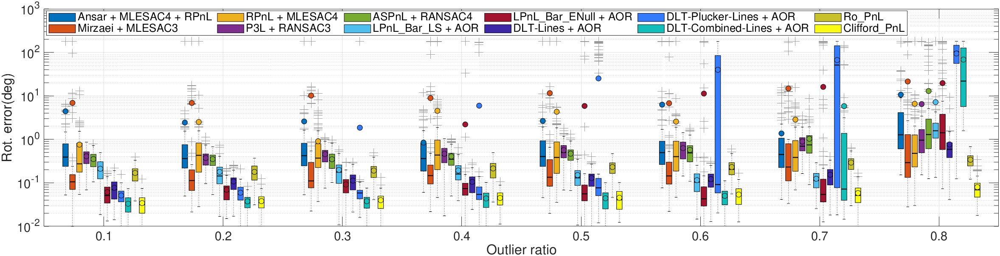

# Solve_PnL_by_Clifford_Torus
xxxxx

## 
This is source code for a paper 

Images
---

Thanks
---
+ The Matlab test framework is copying from "Pose Estimation from Line Correspondences using Direct Linear Transformation" by **Dr. Bronislav Přibyl**, see https://www.fit.vutbr.cz/~ipribyl/DLT-based-PnL/

+ *The plot function aboxplot.m (Advanced Box Plot for Matlab)* by **Dr. Alex Bikfalvi** (alex@bikfalvi.com),see https://alex.bikfalvi.com/

---

Copyright @ YinlongLiu(AT)um.edu.mo
*March 2024*
